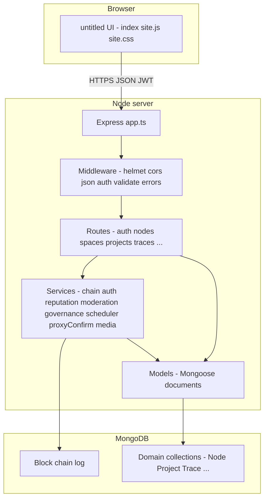

# Assignment 2 — Project jury update (system documentation)

**Purpose:** Single reference for a **mid-project / update jury** (not the final defence). It describes the **backend**, the **simulated chain**, the **frontend**, how they connect, what is **done**, what is **left**, **TODOs**, **test coverage**, **documented loopholes**, **reviews**, **shelved work**, and the **tech stack** with process-level detail.

**Source of truth:** This document is assembled from the **`aura2` repository** at the time of writing. **Project title for this update:** **untitled / undecided** (final name not chosen). The **npm package / repo folder** remain **`aura2`**; the **public UI** currently shows **untitled**. Where the repo does not state a fact, that gap is called out explicitly.

**Companion docs in the repo (read these for depth):**

| Document | Role |
|----------|------|
| [`docs/BACKEND.md`](docs/BACKEND.md) | Full product + chain **specification** (contracts, reputation, moderation, governance, etc.) |
| [`BACKEND-REVIEW.md`](BACKEND-REVIEW.md) | **Loopholes, ambiguities, TBDs**, and recommendations vs the spec |
| [`docs/TODO_BACKEND.md`](docs/TODO_BACKEND.md) | **Backend shelf / TODO** list (gaps vs spec and code TODOs) |
| [`README.md`](README.md) | Setup, env vars, high-level endpoint table |
| [`docs/DEPLOY_RENDER_ATLAS.md`](docs/DEPLOY_RENDER_ATLAS.md) | **Render + MongoDB Atlas** deployment |

---

## 1. Executive summary

The project is a **trust-based, non-financial** system for documenting **artistic / design process**, **attribution**, and **provenance**. It combines:

- A **Node.js + Express + TypeScript** API backed by **MongoDB (Mongoose)**.
- A **hash-linked “chain”** implemented as **MongoDB documents** (`Block` collection): **not** a public L1/L2 blockchain, but an **append-only, hash-chained log** of significant events.
- Rich **domain collections** (`Node`, `Space`, `Project`, `Trace`, `Veto`, `NFT`, flags, mediations, governance proposals, etc.) that enforce **business rules** and power the API.
- A **vanilla** browser client (**no React/Vue**): **`public/index.html`**, **`public/css/site.css`**, **`public/js/site.js`**, with **hash routing** (`#/…`) and **`fetch`** to the same-origin API.

**What works end-to-end (high level):** registration/login/recovery, profiles, spaces, projects, traces (with modes/proxy), references, pivots, vetos, forks, credits + signing, NFT/provenance views, archives, notifications, uploads (hashing), plus large **moderation / mediation / governance / content-safety** surfaces backed by tests and routes.

**What is still open:** Spec **Phase 4** mechanics, **trustees-based social recovery** (beyond seed recovery), **pagination**, some **enforcement audits**, **space application** flow, parts of **Phase 3C** content safety, and several **TODOs** in `docs/TODO_BACKEND.md` and `src/app.ts`.

### 1.1 Author context — jury update (as stated by the author)

**How this will be presented:** The author plans to **explain orally what has been done**, **show the jury the working website**, and supply **this document** as the structured written record of the system (backend, frontend, chain model, status, limitations, and tests).

**Project naming:** The **final product name is undecided**; for this submission the project is referred to as **untitled / undecided**. The codebase still uses **`aura2`** as the **package/repository** identifier until renaming is decided.

**Thesis chapter mapping:** **Not included** in this document (per author request).

### 1.2 Failures and setbacks — author’s meaning (with technical reasoning)

In this update, **“failures”** means **things that still need fixing**, not a formal incident log. Grouped as follows:

**1. Flaky or unreliable test runs**

- The integration suites (`test-full.ts`, `test-userflow.ts`, `test-moderation.ts`, etc.) are executed with **`npx ts-node`** against a **live server** and **real MongoDB**, not an isolated in-memory harness.
- **Why they flap:** Leftover **DB state** from previous runs, wrong **`BASE_URL`**, **NODE_ENV** / **production rate limits** on auth routes, **ordering** assumptions across long flows, and **timing** (background scheduler, reputation updates) can change outcomes between runs.
- **Technical reasoning:** Without **CI** spinning up a **clean database per run**, **fixtures**, or **mocks**, these scripts behave as **smoke / regression** checks rather than **deterministic** unit tests — so occasional failure is expected until automation is hardened.

**2. Shelved features (e.g. Phase 3C content safety)**

- `docs/TODO_BACKEND.md` records that **part of Phase 3C** was **temporarily shelved due to failures**, then **minimally unblocked** so tests could run again; **full** CSAM/NCII/legal/emergency paths remain **to verify and complete**.
- **Technical reasoning:** Content-safety behaviour is **high-impact**; shipping half-correct rules (wrong deletion scope, weak encryption story, unclear appeal windows) is **riskier than deferring**. Shelving preserves a **known gap** instead of a **false sense of completeness**.

**3. Personal process setbacks**

- Examples the author groups here: **underestimating scope** where the **spec** (moderation, governance, safety) is large relative to **visible UI** work; **context-switching** between spec writing, backend routes, and frontend polish; **debugging cost** of long multi-user flows.
- These are **process and prioritisation** issues the author is still improving (smaller vertical slices, clearer milestones, more automation). They are **not** stored in git as metrics — this paragraph is **for the jury narrative only**.

### 1.3 Limitations of the project

These are **inherent or current** constraints; they complement **§9 (loopholes)** and **`BACKEND-REVIEW.md`**.

**Architecture & trust model**

- The **“chain”** is a **hash-linked log in MongoDB**, not a replicated public blockchain. **Integrity** depends on **database access control** and server honesty; there is **no** decentralised consensus or immutable global ledger.
- **Single database** — operational **single point of failure** unless Atlas/backup/DR are configured and maintained outside this repo.
- **Server-held secrets** — `JWT_SECRET`, `ENCRYPTION_KEY`, and DB credentials must be protected; compromise of the host implies compromise of the system.

**Spec vs implementation**

- Large parts of **`docs/BACKEND.md`** are **aspirational**; **`docs/TODO_BACKEND.md`** tracks **gaps** (e.g. full **Phase 4** automation, **trustees-based social recovery**, **space application** enforcement, **pagination**, **proxy deadline** hardening, **credit** timeout escalation).
- **Phase 3C (content safety)** — explicitly noted in project docs as **partially shelved** after failures, then **minimally unbounded** for tests; **not** a complete production-grade safety pipeline.
- **Identity rule** (“one person, one node”) is **social / policy**, not **cryptographically enforced**.

**Security & abuse**

- **Rate limiting** applies to **login/register in production** only (`src/app.ts`); other endpoints rely on normal app logic and infra limits.
- **List endpoints** return **full result sets** (no pagination yet) — **DoS / performance** risk as data grows (`src/app.ts` TODO).
- **VETO / trace visibility** — documented need to **audit all read paths** for consistent redaction / `ndaSealed` behaviour (`docs/TODO_BACKEND.md`).

**Evidence & provenance**

- **Archives** and **reconstruction** rely on **self-reported** metadata and **client-computed** hashes in the UI; they do **not** by themselves prove off-system creation dates or file authenticity.
- **REFERENCE** immutability (per spec) implies **no** trivial correction path for honest mistakes (see **BACKEND-REVIEW.md**).

**Frontend**

- **Vanilla JS** in one large **`site.js`** — harder to modularise, test, and onboard than a component framework.
- **No automated UI tests** in the repository.
- **Desktop-first** styling (`min-width` on root); **small screens** are not a first-class target.
- **Discover** — no **search index** API yet; only **exact alias** lookup and a **TODO** for real discovery.

**Engineering process**

- **No `npm test` / CI** wired in `package.json`; quality relies on **manual** `npx ts-node test-*.ts` runs against a **live server** and DB.
- **README** states Node **≥18**; **`package.json`** requires **≥20** — documentation **drift**.

**Operational**

- **Native dependencies** (e.g. **Sharp**) can complicate deploys on some Node/OS combinations (mitigations exist in boot order comments, but risk remains).
- **Background jobs** use **in-process** `setInterval` — **not** a durable queue; restarts can delay decay/proxy jobs until the next tick.

**Academic / product honesty for jury**

- The system is best described as a **process documentation and attribution platform** with a **tamper-evident append log**, not a **trustless** network layer.

---

## 2. Tech stack — what each piece does

### 2.1 Runtime & language

| Technology | Version / note | Role |
|------------|----------------|------|
| **Node.js** | `package.json` engines **`>=20`** (README still mentions ≥18 in places — **align before jury**) | JavaScript runtime for the server |
| **TypeScript** | ^5.9 | Typed source; compiles to `dist/` |
| **npm** | — | Dependency install; **`postinstall` runs `build`** so deploys get `dist/` |

### 2.2 HTTP API layer

| Technology | Role |
|------------|------|
| **Express 5** | HTTP router, JSON body parser, static file host for `public/` |
| **cors** | Cross-origin (often same-origin when UI is served by Express) |
| **helmet** | Default security headers |
| **express-rate-limit** | **Production-only** limits on `/auth/login` and `/auth/register` (`src/app.ts`) |

### 2.3 Data & validation

| Technology | Role |
|------------|------|
| **MongoDB** | Primary database (Atlas or local) |
| **Mongoose 9** | ODM: schemas, indexes, queries |
| **Zod 4** | Request body validation (`src/middleware/validate.ts` + `src/schemas/*`) |

### 2.4 Security & identity

| Technology | Role |
|------------|------|
| **bcryptjs** | Password hashing |
| **jsonwebtoken** | JWT issued at register/login; **`Authorization: Bearer`** on protected routes |
| **bip39** | 12-word seed phrase generation for registration |
| **dotenv** | Loads `JWT_SECRET`, `MONGODB_URI`, `ENCRYPTION_KEY`, etc. |
| **AES-style encryption** (via **`ENCRYPTION_KEY`** 64 hex chars) | Encrypts seed material at rest (see auth implementation) |

### 2.5 Media & uploads

| Technology | Role |
|------------|------|
| **multer** | Multipart uploads |
| **sharp** | Image processing (native addon; **lazy/dynamic import** pattern in `server.ts` comments to avoid boot crashes on some hosts) |

### 2.6 Tooling

| Technology | Role |
|------------|------|
| **ESLint + Prettier** | Lint/format |
| **nodemon + ts-node** | `npm run dev` |
| **tsc** | `npm run build` → `dist/` |

### 2.7 Frontend (delivered UI)

| Piece | Role |
|-------|------|
| **Static HTML** | `public/index.html` — shell, loading strip, `#app` mount |
| **CSS** | `public/css/site.css` — “Swiss grid × Win95 bitmap” design tokens, layout shells |
| **Vanilla JS** | `public/js/site.js` — hash router, `fetch` API client, renders HTML strings |
| **`<meta name="aura-api-base">`** | Optional API base override (empty = same origin) |

**Explicitly not in repo:** React, Next.js, Webpack, Vite (aligned with **BACKEND.md TBD** still listing frontend framework TBD historically; **current implementation is vanilla**).

### 2.8 Testing (as present in repo)

There is **no** `npm test` script in `package.json`. Integration checks are **standalone TypeScript files** run with **`npx ts-node`** (or `tsx`) against a **running server** and/or **MongoDB**. See **§10**.

---

## 3. System architecture — how it fits together

### 3.1 Boot sequence (`src/server.ts`)

Order is **intentional** for PaaS stability:

1. **`assertProductionEnv()`** — on production-like hosts, enforces **`MONGODB_URI`**, non-default **`JWT_SECRET`**, valid **`ENCRYPTION_KEY`** (64 hex).
2. **`connectDatabase()`** — Mongoose connects.
3. **`ensureGenesis()`** — ensures **`Block`** index `0` exists (`src/services/chain.ts`).
4. **`ensureUploadDir()`** — upload filesystem prep.
5. **`startScheduler()`** — background intervals (**§3.4**).
6. **Dynamic `import('./app')`** — loads Express after DB/genesis so heavy deps (e.g. **sharp**) do not abort early boot.
7. **`listen`** on **`0.0.0.0:PORT`**.

### 3.2 Simulated chain vs domain state

| Layer | Storage | Purpose |
|-------|---------|---------|
| **Blocks** | `Block` collection | Append-only **hash chain** (`previousHash`, `hash`, `index`, `type`, `alias`, `data`). **`addBlock`** retries on duplicate index (concurrency). **`validateChain`** recomputes hashes. |
| **Domain docs** | Many collections | **Queryable state**: projects, traces, vetos, NFTs, etc. Routes **write domain first** (or in concert) and **append blocks** for auditable events where implemented. |

**Block types observed in code** (from `addBlock` call sites): `genesis`, `identity`, `start`, `trace`, `reference`, `pivot`, `veto`, `fork`, `archive`, `credit`, `mediation`, `governance`, `flag` (via moderation). *Not every micro-update may be block-level; the spec and implementation evolve together.*

### 3.3 Typical HTTP request path

1. Client sends **`fetch(path, { headers: { Authorization: Bearer … }, body: JSON })`**.
2. **Express** matches a **router** under `src/routes/*.ts`.
3. **`optionalAuth` or `requireAuth`** attaches **`req.node`** when JWT valid.
4. **`validate(schema)`** parses body with **Zod**.
5. Handler reads/writes **Mongoose** models, may call **services** (`reputationEngine`, `chain.addBlock`, `moderation`, …).
6. **`errorHandler`** maps thrown **`AppError`** subclasses to status codes.

### 3.4 Background jobs (`src/services/scheduler.ts`)

| Interval | Job | Role |
|----------|-----|------|
| **Daily** | `runProxyAutoConfirm` | Proxy log auto-confirmation path (see **TODO_BACKEND**: deadline enforcement nuances) |
| **~Monthly** (capped for Node timer limits) | `runReputationDecay` | Applies decay rules from config |

**Operational note:** Comment in scheduler documents a **Node.js timer overflow** bug that previously caused tight loops on Render — **mitigated** by capping interval.

---

## 4. Chain rules (condensed from the specification)

The **authoritative** list is **`docs/BACKEND.md`**. Below is a **jury-safe summary**:

- **Trust-based, non-financial** — no token economics in this implementation’s core flows.
- **Identity** — **alias** is unique and **permanent**; **no email/phone/real name** in the spec’s identity model.
- **Recovery** — **seed phrase** + password reset implemented; **trustees-based social recovery** still **TODO** per `TODO_BACKEND.md`.
- **Contracts (base)** — Spec defines **START, TRACE, REFERENCE, PIVOT, VETO, FORK, CREDIT, ARCHIVE**, plus **governance / moderation** tiers. The API exposes routes matching these concepts.
- **Reputation** — Score **floor/cap/decay/grace** configurable in **`src/config/defaults.ts`**; **category radar** for display; voting uses **overall score** per spec notes.
- **Governance** — **Supermajority** threshold configurable (`supermajorityThreshold`); phase transition thresholds exist as **config** (full **Phase 4** automation **TODO**).
- **Moderation** — Flags, panels, complexity levels, appeals window (days) tied to config.

For **loopholes and ambiguities** in these rules, see **§9** and **`BACKEND-REVIEW.md`**.

---

## 5. Backend modules — responsibilities

| Area | Path pattern | Responsibility |
|------|----------------|-----------------|
| Config | `src/config/` | Env, DB URI, **chainDefaults** |
| Middleware | `src/middleware/` | JWT auth, optional auth, Zod validate, errors |
| Models | `src/models/` | Mongoose schemas |
| Schemas | `src/schemas/` | Zod input schemas |
| Routes | `src/routes/` | HTTP handlers (mounted in `app.ts`) |
| Services | `src/services/` | Chain, auth crypto, reputation, moderation, governance, scheduler, media, proxy confirm, content safety |
| Utils | `src/utils/` | Hashing, errors, helpers |

**Mounted routes** (from `src/app.ts`):  
`/auth`, `/nodes`, `/spaces`, `/projects`, `/traces`, `/` (upload), `/vetos`, `/pivots`, `/references`, `/credits`, `/nfts`, `/forks`, `/archives`, `/mediations`, `/flags`, `/governance`, `/notifications`.

**Global TODO in code:** `src/app.ts` notes **list endpoints lack pagination** (cursor/offset future work).

---

## 6. Core processes — how they work (step-by-step)

### 6.1 Registration (`POST /auth/register`)

1. Client sends **alias + password**.
2. Server validates (Zod), checks alias unused.
3. **bcrypt** hashes password; **BIP-39** generates **12-word seed**; seed material encrypted with **`ENCRYPTION_KEY`** for storage.
4. **JWT** minted; **Node** document created with spaces array, reputation defaults, etc.
5. **`addBlock('identity', …)`** records identity anchor on the **Block** chain.
6. Response returns **token + seed phrase** (user must save phrase).

### 6.2 Login (`POST /auth/login`)

1. Alias + password → verify bcrypt → issue new JWT (**token versioning** may invalidate old tokens — see `Node` model / auth service).

### 6.3 Seed recovery (`POST /auth/recover`)

1. Alias + seed phrase + new password → verify seed → reset password → new JWT.

### 6.4 Space lifecycle

1. **`POST /spaces`** — authenticated user creates space; settings (access, veto authority, thresholds, privacy defaults) stored on **Space**.
2. **`POST /spaces/:id/join`** — member joins (open or invite code).
3. **`GET /spaces/:id`** — members see details; invite codes only for members.
4. **`PATCH /spaces/:id/settings`** — admin-only updates.

### 6.5 Project lifecycle (START)

1. **`POST /projects`** — title, **spaceId**, **contributors** (aliases + roles), optional mentor.
2. **`addBlock('start', …)`** records START.
3. **Project** document tracks **status** (`active`, `halted`, `completed`, `disputed`, `archived`, …).

### 6.6 TRACE

1. **`POST /traces`** — activity type, mode (micro/memo/reflection/proxy), description, optional duration/tools.
2. Reputation hooks (**`reputationEngine`**) run on trace creation (e.g. category updates, badges — see tests `test-userflow.ts` notes).
3. **`addBlock('trace', …)`** for trace events.
4. **Proxy** traces may require **`PATCH /traces/:id/proxy-confirm`**; **scheduler** assists auto-confirm path.

### 6.7 REFERENCE, PIVOT, VETO, FORK

- Each has **POST** routes, persists domain documents, appends **typed blocks** where implemented.
- **VETO** types affect **project status** and **trace visibility** (NDA seal, scope, etc.) — enforcement documented partially in **TODO_BACKEND** (audit other read paths).

### 6.8 CREDIT + NFT

1. **`POST /credits`** — defines split / flags / optional off-chain contributors; creates **NFT** record and contributor token state as per implementation.
2. **`POST /credits/:nftId/sign`** — contributors **sign** acceptance.
3. **`GET /nfts/:id`** — bundled NFT + project (+ archive flag) for provenance UI (**auth-gated** in current product; frontend directs anonymous users to login).

### 6.9 Archive (past work)

1. **`POST /archives`** — reconstruction flag, evidence hashes, space linkage; **`addBlock('archive', …)`**.

### 6.10 Upload

1. **`POST /upload`** — file → stored/processed via **media** service; **SHA-256** (and **Sharp** where applicable) for integrity/metadata.

### 6.11 Notifications

- **`GET /notifications`**, **`PATCH /notifications/read-all`** — used by the **topbar bell** in `site.js`.

### 6.12 Moderation / flags / mediation / governance (summary)

Large surface area: **flags** create **panels** and complexity flows; **mediations** append **mediation** blocks; **governance** proposals append **governance** blocks. **Details** are in `docs/BACKEND.md` and route files. **Tests** (`test-moderation.ts`, `test-mediation.ts`, `test-governance.ts`, `test-content-safety.ts`) document expected behaviours.

---

## 7. Frontend — structure and behaviour

### 7.1 Routing

- **Hash-based:** `#/dashboard`, `#/projects/:id`, `#/nodes/:alias`, etc. **`parseRoute()`** in `site.js`.
- **Auth guard:** `requireAuth` redirects to **`#/login`** for protected views.

### 7.2 API client

- **`api(path, { method, body, token })`** — central `fetch`; toggles **global loading** strip; throws on non-OK.

### 7.3 Major screens (current)

- **Landing** — hero, register/login CTA (no auto-redirect when logged in).
- **Dashboard** — contributions (radar, badges, score), active spaces cards, active projects + link to **`#/projects`** board.
- **Projects board** — **`#/projects`** partitions by status columns.
- **Profile** — **`#/me`** combined wireframe + **PATCH /nodes/me** form; public **`#/nodes/:alias`** mirrors layout with login/register callout for guests.
- **Space / project** — CRUD-style flows matching API.
- **Discover** — **TODO** for search API; **exact alias** lookup only.
- **Topbar** — home, nav `
`, notifications panel, sign out.

### 7.4 Frontend review (honest)

**Strengths**

- **No build step** — easy to host with static + API same origin.
- **Matches** many **API** flows literally (credits sign, archive hash, etc.).
- **Visual system** documented in CSS variables (CMYK-ish, mono, borders).

**Gaps / risks**

- **Large single file** `site.js` — maintainability cost.
- **Discover** depends on **future backend** for real search.
- **Profile “bio”** — spec may imagine richer text; **API** exposes **keywords/interests/portfolio** — UI maps honestly but is not a full “statement” field until backend extends `Node`.
- **Accessibility / i18n** — not a focus in current markup.
- **No automated frontend tests** in repo.

---

## 8. Backend review (status vs spec)

**Implemented breadth:** The codebase covers **auth**, **spaces**, **projects**, **traces**, **references**, **pivots**, **vetos**, **forks**, **credits**, **NFTs**, **archives**, **uploads**, **notifications**, and substantial **moderation / mediation / governance / content safety** — aligned with large parts of **`docs/BACKEND.md`**.

**Documented gaps:** See **`docs/TODO_BACKEND.md`** (summarised in **§11**).

**Spec vs implementation drift risk:** `docs/BACKEND.md` lists **Jest/Vitest** as testing stack; **this repo uses manual `ts-node` scripts** instead — update the spec or add Jest later for jury consistency.

---

## 9. Loopholes, ambiguities, and system risks

**Do not treat this as exhaustive code audit** — it mirrors **`BACKEND-REVIEW.md`** (spec-level). Examples:

- **Proxy silence = confirm** — inactive users may lose dispute window.
- **Social recovery “majority”** — clarified partially via **`socialRecoveryMajorityFraction`** in config, but full **trustees flow** still TODO.
- **REFERENCE immutability** — typo/wrong URL cannot be corrected without a spec change.
- **One person = one node** — social deterrence only, not cryptographic.
- **CREDIT mediation** — strategic non-response risks (spec ambiguity).
- **VETO hard stop** — single preassigned authority power.
- **Moderator selection** — “first to accept” gaming risk.
- **Archive** — self-reported dates / reconstruction.
- **NDA sealed content** — who can decrypt in disputes underspecified.
- **Protocol fork mechanics** — underspecified at spec level.

**Full narrative:** [`BACKEND-REVIEW.md`](BACKEND-REVIEW.md).

---

## 10. Tests — what exists and how to run them

All require **Node with `fetch`** (Node 18+) unless noted. Default base URL: **`http://localhost:3000`** via **`BASE_URL`** (or **`AURA2_BASE`** for userflow).

| File | Focus | Typical command |
|------|--------|-----------------|
| **`test-full.ts`** | Broad integration: health, auth, spaces, projects, traces, vetos, forks, credits, NFTs, governance touches, security cases | `npx ts-node test-full.ts` |
| **`test-userflow.ts`** | Long multi-user flow (riku/prof/maya-style scenario), reputation/badge expectations | `npx ts-node --transpile-only test-userflow.ts` |
| **`test-phase2-fixes.ts`** | VETO halted vs completed, fork `targetSpaceId`, credit dispute, reference on halted | `npx ts-node test-phase2-fixes.ts` |
| **`test-moderation.ts`** | Moderation panels / flags (uses DB + API) | `npx ts-node test-moderation.ts` |
| **`test-mediation.ts`** | Mediation flow | `npx ts-node test-mediation.ts` |
| **`test-governance.ts`** | Tier 3 governance | `npx ts-node test-governance.ts` |
| **`test-content-safety.ts`** | Content safety / media / emergency paths (Mongo + API) | `npx ts-node test-content-safety.ts` |

**Failures:** If a test fails, the script prints **pass/fail** lines; there is **no CI config** in the snippets reviewed — **run manually** before jury demos.

---

## 11. TODOs and what is left

### 11.1 Backend (`docs/TODO_BACKEND.md` — abbreviated)

- Phase **4** autonomous transition mechanics.
- **Trustees-based social recovery** + outreach/collaboration request system + harassment limits.
- **VETO / trace visibility** — audit all read paths for `ndaSealed` / redaction rules.
- **Phase 3C** content safety — CSAM/NCII/legal paths; some work **shelved after failures**, later partially unblocked (per doc).
- **Mediation** cross-space classification TODO in code.
- **Pagination** for list endpoints (`app.ts` TODO).
- **Proxy** auto-confirm deadline enforcement TODO (`traces.ts`).
- **Fork** parent contributor notification TODO.
- **Credits** off-chain cross-check; signing timeout → mediation.
- **Space application** enforcement placeholder.

### 11.2 Frontend (from product direction, not a single TODO file)

- **Discover** — real search/index API + UI filters.
- **Optional** — split `site.js`, add component pattern or framework if project grows.
- **Rich profile fields** — need **backend** support for true “bio” beyond keywords/interests.

### 11.3 Shelved / failed work (as stated in repo docs)

**`docs/TODO_BACKEND.md` explicitly states:** some **Phase 3C** work was **“temporarily shelved due to failures”**, later **minimally unblocked** to make tests runnable — remaining Phase 3C items still listed for verification. This aligns with **§1.2** (author’s definition of failures and technical reasoning).

**No central engineering failure log** with timestamps lives in the repo — for a **chronology of incidents**, use **git history** and personal notes.

---

## 12. What could be done next (suggestions)

Prioritised **pragmatic** next steps (not commitments):

1. **Pagination** on high-volume lists (performance + jury demo on large DB).
2. **Trustees recovery** end-to-end + UI.
3. **Close TODO_BACKEND items** one by one with tests.
4. **CI** — GitHub Action: `npm run lint`, `npm run build`, optional scripted test against ephemeral DB.
5. **Frontend** — discover backend + polish OR adopt a framework if complexity warrants.
6. **Documentation sync** — README Node version vs `package.json` engines.

---

## 13. Deployment & operations

- **Render + Atlas:** [`docs/DEPLOY_RENDER_ATLAS.md`](docs/DEPLOY_RENDER_ATLAS.md).
- **Health:** `GET /health`.
- **Static UI:** Express serves **`public/`** — **`/`** loads main app, **`/demo.html`** minimal API tester.
- **Production env validation:** `server.ts` **exits** if secrets invalid (fail-fast).

---

## 14. Glossary

| Term | Meaning |
|------|---------|
| **Chain (in this project)** | Hash-linked **`Block`** documents in MongoDB |
| **START / TRACE / …** | Spec “contracts” mapping to API behaviour |
| **Node** | User account + profile (alias) |
| **Space** | Collaboration container |
| **Project** | Work unit under a space |
| **Trace** | Work log entry |
| **NFT (here)** | Provenance / credit record artefact in DB, not an on-chain ERC-721 deployment unless extended elsewhere |

---

## 15. Revision history

| Date | Change |
|------|--------|
| *(this edit)* | Added **§1.1–1.2** author jury plan, **untitled / undecided** naming, failures/setbacks definition with technical reasoning; thesis mapping omitted per author. Renumbered **Limitations** to **§1.3**. |

---

*End of Assignment 2 document.*
