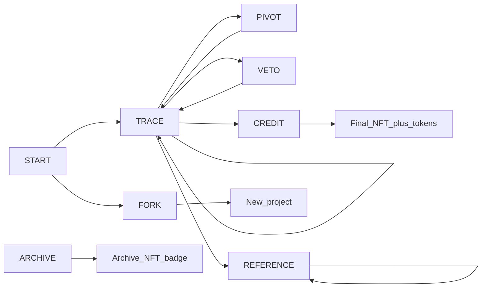

# Chapter 7 — Contracts (the base protocol actions)

> **“Smart contract” in Etch** often means: a **well-defined, typed, protocol event** the system is supposed to **record, check, and enforce**—in code, in moderation, and in the append-only `Block` log. It is **not** automatically an Ethereum EVM program here; the dApp is TypeScript + MongoDB, with a **hash-linked** `Block` model.

## Overview diagram

## How a user *uses* a contract (in practice)

- **In the app:** the web client calls **HTTP routes** (e.g. `POST` for traces, `POST` for project start). The server **validates** your JWT, your **space/project membership**, and your body fields.
- **On the server:** the handler writes or updates `Trace` / `Project` / `Veto` / … and calls **`addBlock(type, …)`** to append a matching **`Block`**.

> Not every `Block.type` in `src/models/Block.ts` has a one-button screen yet—use [Chapter 13](13-implemented-vs-planned.md) for a route-by-route inventory.

---

## 1. START

**Purpose:** open a new **active** project in a **space** with a contributor list.

| Aspect | Detail |
|--------|--------|
| **Who** | A node that is **allowed** to start projects in that **space** (`projectAccess`). |
| **Required (spec)** | `title`, at least one **signing** `creator` / contributor, `spaceId`. |
| **Optional (spec)** | `context` (narrative), `reference` (to outside work/lineage in narrative form), `pedagogicalId` (course context). If pedagogy: **mentor** role gets elevated. |
| **Output** | `projectId` (Mongo id), `contributors[]`, `status: active` (in normal flow), and a **`start` block** in the `Block` collection. |
| **Rules (spec)** | **≥1 node** must co-sign; pedagogy may auto-tag **mentor** as elevated. |
| **User action** | Open “new project” in a space, fill in title, add contributors, **submit**. |

**Implementation anchor:** `Project` in `src/models/Project.ts`, `startBlockIndex`, project routes under `src/routes/`.

---

## 2. TRACE

**Purpose:** the **default creative act** in Etch—**log one step** of work: research, build, review, or AI use.

| Aspect | Detail |
|--------|--------|
| **Who** | Any **contributor** on the `Project.contributors` list with `active` project. |
| **Required** (model) | `projectId`, `nodeAlias` (the caller’s alias from JWT), `activityType`, `timestamp`, `mode`. |
| **Activity types** (`ACTIVITY_TYPES` in `src/models/Trace.ts`) | `brainstorm`, `primary_research`, `secondary_research`, `iterate`, `skillwork`, `fabrication`, `pedagogy`, `admin`, `review`, `ai_tool`, `other` — if `other`, fill `otherDescription`. |
| **Modes** | `micro` (quick), `memo` (standard with description and optional file), `reflection` (longer), `proxy` (log for someone else). |
| **Optional** | `description`, `duration` (minutes), `toolSoftware` (satisfies **AI** declaration when you pick `ai_tool` + honest tools), `mediaId` to attached file. |
| **Media (spec + code)** | **File in DB** (via upload route); `mediaHash` and **id** on the trace. **Hash** is what the chain can anchor to. |
| **Proxy (spec)** | **PROXY** on the chain: the **subject** has **7 days** to **confirm** or **dispute**; **silence = confirm**; a dispute can become an **attribution flag** (see [Chapter 12](12-system-flows.md)). |
| **Output** | A `Trace` document + **`trace` block** with a monotonically increasing `blockIndex` on the trace. |
| **User action** | “Log work” on a project, pick activity, attach optional file, set tools, submit. |

**Redaction (API):** if a trace is `scopeLimited` or `contentFlagged`, non-owners may see **redacted** description fields in `traces` GET handlers—**timestamps and ids remain**.

---

## 3. VETO

**Purpose:** **stop, narrow, or seal** work without deleting history.

| Aspect | Detail |
|--------|--------|
| **Veto types** (`VETO_TYPES` in `src/models/Veto.ts`) | `hard_stop`, `scope_limit`, `content_flag`, `nda_seal` |
| **Who** (spec) | For **hard stop:** either **preassigned** veto authority in the **space** or a **supermajority** of contributors, depending on rules. NDA: hash public, **content encrypted**; **not even space admins** can read. |
| **Model fields** | `projectId`, `nodeAlias`, `vetoType`, `reasonHash` (a hash, not the raw private reason in public views), `targetTraceIds[]`, `signatures[]`, `status` (`pending` / `active` / `rejected`), `blockIndex`. |
| **User action** | Open “raise veto / scope / NDA” in UI (or API); supply reason through the flow; collect signatures in **hard** cases. |

The **`veto` block** type exists in the `Block` model.

---

## 4. PIVOT

**Purpose:** **record a change in direction** while keeping the project **active** (unlike a hard stop).

| Aspect | Detail |
|--------|--------|
| **Who** | A contributor. |
| **Input** (spec) | `projectId`, `nodeAlias`, **pivot reason** (narrative / hash, depending on privacy). |
| **Effect** | **Branch point** stored in the process token; project continues. |
| **User action** | “Pivot project” with a clear written reason. |

`Block` type: `pivot`.

---

## 5. CREDIT (end / provenance / contributor split)

**Purpose:** **close the project** and **fix** contribution shares and roles on chain.

| Aspect | Detail |
|--------|--------|
| **Who** | **All primary contributors** must sign (per spec). |
| **Input** (spec) | Final **contributor** list, **roles**, optional **weight map**, optional `dispute` flag. |
| **If weights disagree** | **Mediation**; if mediation **fails**: **equal split** + a **DISPUTED** mark on the Final / provenance (per `BACKEND.md`). |
| **Output** (spec) | **Soulbound** contributor / process **tokens**; a **Final NFT** / provenance object that may be **transferred** but whose **credits and provenance are immutable**; a **`credit` block**. |
| **Off-chain people** (spec) | Can be **unclaimed** with permission to add company/portfolio later if they **join the chain**. |
| **User action** | “End project & split credit”; each primary opens the signing view; on dispute, follow [mediation](12-system-flows.md). |

> NFT minting may still be “DB + metadata” in the app until a public chain is wired—[Chapter 13](13-implemented-vs-planned.md).

---

## 6. REFERENCE (lineage & inspiration)

**Purpose:** a **dedicated, immutable** layer for *plagiarism vs inspiration* and **acknowledging sources/AI**.

| Relationship types (spec examples) | *inspired by, built on, forked from, in response to, pedagogical source, AI generated, other (free text required)* |
|--------|--------|
| **Who** | The **author** of the work declares. |
| **Immutability** | After posting: **not editable or deletable** (spec) — a known tension; see `BACKEND-REVIEW.md` for the **correction / dispute** gap. |
| **Output** | A **`reference` block**; reference id in the “process token” narrative in spec. |
| **User action** | “Add reference / cite inspiration / mark AI” on a project. |

---

## 7. FORK (project line)

**Purpose:** **new project** that **branches** from a parent, keeping **inherited** credit view but **re-earning** reputation in the new thread.

| Rules (spec) | Notify parent **contributors**; **inherited** credit visible; **reputation in fork is only from new work**; if parent space was **dormant**, the fork carries a **visible** lineage mark. |
|--------|--------|
| **User action** | “Fork this project” with a public reason, confirm inherited contributors, create child project. |

`parentProjectId` in `src/models/Project.ts` is the data anchor.

**Block** type: `fork`.

---

## 8. ARCHIVE (retroactive / reconstruction)

**Purpose:** document a **finished or past** work with **reconstruction** honesty.

| Required (spec) | `title`, `medium`, **approx** date, `creator`, **evidence** type, **evidence** hash, **`reconstructionFlag: true`**. |
|--------|--------|
| **Evidence types** | Match `src/models/Archive.ts` and `src/models` evidence enums: e.g. `photos_of_work`, `sketches`, `dated_files`, `social_post`, `videos`, `exhibit_record`, `institution_record`, `url`, `portfolio_link`, `other`… |
| **Attestations** | `self` / `peer` / `institution` with relationship: collaborator, witness, mentor, institutional contact. |
| **Reputation (spec)** | **Lower** base weight than a live, continuously traced project; **self-only** is weakest; need **cross-attestation** for real impact. |
| **Output** | `archive` + NFT with an **archive badge** (in product terms). |
| **User action** | “Add archive project,” upload or link **evidence**, mark reconstruction, request peer attestation. |

**Block** type: `archive`.

---

## 9. CUSTOM (space-level, constrained)

**Purpose:** **extra** rules a **space** can deploy **on top of** the base system—*without* breaking meta rules.

| May **not** (spec) | Override **base** contracts, **collect PII** silently, add **payment** / tokens for money, grant permissions above **meta** governance, ban members without moderation. |
|--------|--------|
| **If affects all space members** | **Supermajority of members** (not just admins) must sign. |
| **Must** | **Plain-English** description on chain, review by all **affected** parties, compliance review. |
| **Enforcement** | Protocol can **flag or freeze** abusers. |
| **User action** | “Propose a custom space contract” through a governance / admin UI, collect signatures, deploy (when implemented). |

---

## Quick “which contract do I use?”

| I want to… | Contract |
|------------|----------|
| Start a new thread of work in my studio | **START** |
| Log today’s work / upload proof | **TRACE** |
| Change direction (but keep going) | **PIVOT** |
| Stop, narrow scope, or NDA-seal | **VETO** |
| Close, split credit, mint provenance | **CREDIT** |
| Cite an influence or AI / fork lineage | **REFERENCE** |
| Branch a new line from an old one | **FORK** |
| Document the past with evidence | **ARCHIVE** |
| Add a space-only rule the protocol allows | **CUSTOM** (if the space allows it) |

## Further reading

- Full normative spec: [../BACKEND.md](../BACKEND.md)  
- Loophole notes: [../../BACKEND-REVIEW.md](../../BACKEND-REVIEW.md)  
- Model enums: `src/models/Trace.ts`, `Veto.ts`, `Archive.ts`, `Block.ts`  
- [Chapter 12 — All flows](12-system-flows.md)  
