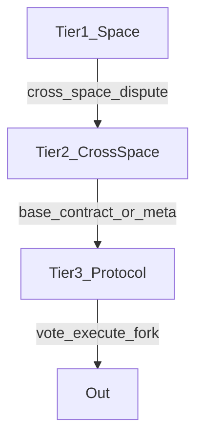

# Chapter 10 — Governance (three tiers, validators, protocol)

Etch is meant to be **governed** at three **levels** of scope, with **transparency** at the top and **local autonomy** at the bottom—**without** letting a space or clique break **global human-rights, attribution, and non-financial** rules.

## Three tiers (conceptual)

| Tier | Scope | Bodies / tools |
|------|--------|----------------|
| **1 — Space** | A single `Space` | Admins, **space** `votingThreshold`, `vetoAuthority`, `projectAccess`, `minDocRequirements` |
| **2 — Cross-space** | A dispute or recognition involving **2+** spaces | **Coordinated moderators** from *each* involved space before escalating |
| **3 — Protocol (meta / chain-wide)** | **Base contracts**, meta **rulebook** changes, **protocol** `GovernanceProposal` | **Voting** with time-locked **discussion**; **any node** can open a `GovernanceProposal` in code (`src/routes/governance.ts`) |

**Key rule (spec):** spaces may **tighten** (more restrictive) or **clarify**; they **may not** **override** a **base** or **meta** rule (e.g. “no PII exfil,” “no financial token,” “no unmoderated chain bans from a space”).

**Escalation (spec, summary):** **cross-space** first stops at **Tier 2**; if it touches a **base contract** or the **global rulebook**, it ends up in **Tier 3**.

## Validators, PoA, and PoR (design target)

- **At launch: Proof of Authority (PoA)** — a small, named **validator** set (e.g. founders) signs blocks / advances chain health.  
- **Later: Proof of Reputation (PoR)** — **reputation nodes** are drawn into the validator set; **founder** validators are **phased out**.  

**Phases (from `docs/BACKEND.md`):**

| Phase | Size / trigger (spec) | Validators (spec) |
|-------|------------------------|------------------|
| 1 | Launch, 0–50 **active** nodes | Founder + small PoA set |
| 2 | 50 **active** *or* community vote | **+Top 10** reputation nodes (example) |
| 3 | 200 *or* community vote | **Full PoR**; founders stand down |
| 4 | Community vote | **Autonomous** community, no **central** founder power |

**Supermajority:** moving phases requires **~70%** (spec) agreement.

**Public transparency:** a validator’s status is always **visibly** on the chain, and a validator **may not** moderate a dispute they are a **party** to (spec, see also `BACKEND-REVIEW.md` for edge cases on “influence” outside panels).

> **Reality in this repository:** the “chain” is a **Mongoose `Block` log**; **decentralised** multi-node **consensus** is a **roadmap** item, not the same as `npm start` in dev.

## Tier 3: proposals and voting (as implemented in code)

**Routes (see `src/routes/governance.ts` + `src/services/governance.ts`):**

- **POST** `/governance/proposals` — create a `GovernanceProposal` with a **scope** and **JSON `changes`**, auto-compute a **complexity level**, set **discuss** end time, record a **`governance` block** with `addBlock` (`eventType: 'proposal_created'`, etc.).  
- **POST** `/governance/proposals/:id/vote` — with auth; the service advances **discussion → voting** when the time lock elapses, tallies, may **close** on quorum / deadline.

**Voting / thresholds (per product spec, not all encoded as constants):**  
- **~70%** to change **base contracts**; **simple majority** for some **parameters**; **losing** side may **fork** the protocol in theory (the fork mechanics of the *network* are **TBD** in the audit).

**Transparency (spec):** Tier-3 **votes and outcomes** are **public and auditable** on the chain record.

## Relationship to [moderation](11-moderation-and-flags.md)

- **Flags** and **mediation** handle **abuse, content, and credit disputes** case-by-case.  
- **Governance proposals** change **the rules of the system** for everyone. They are **slower** and **higher** stakes.

## Further reading

- [Chapter 2 — PoA and PoR](02-blockchain-basics.md)  
- [Chapter 5 — What spaces cannot do](05-spaces.md)  
- [Chapter 11 — Full moderation and appeals](11-moderation-and-flags.md)  
- [Chapter 13](13-implemented-vs-planned.md) — which governance pieces are fully wired in the API.  
