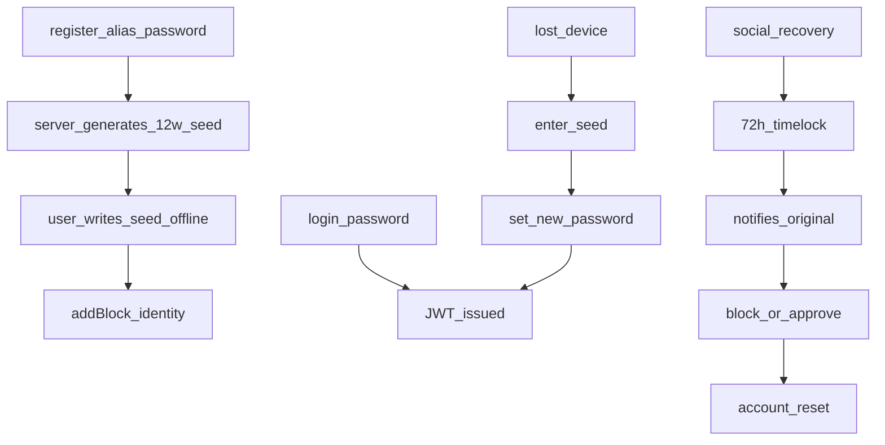
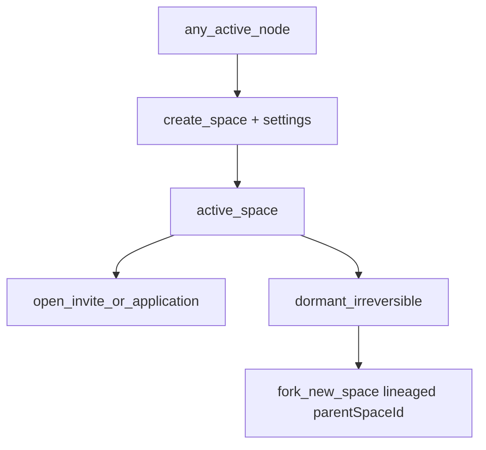
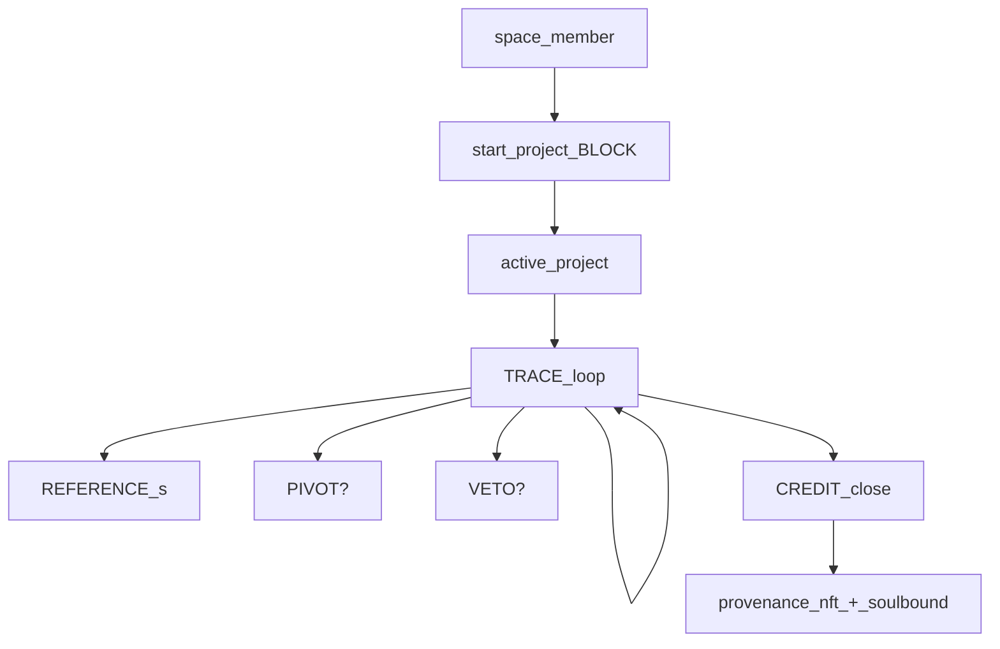
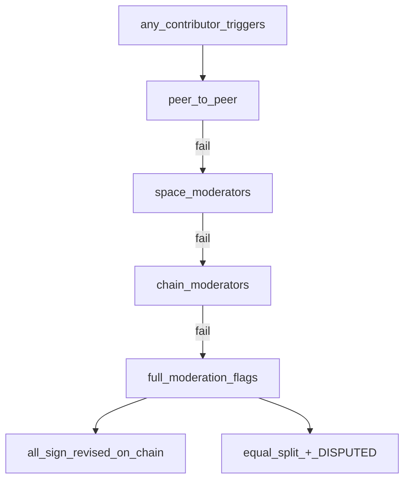
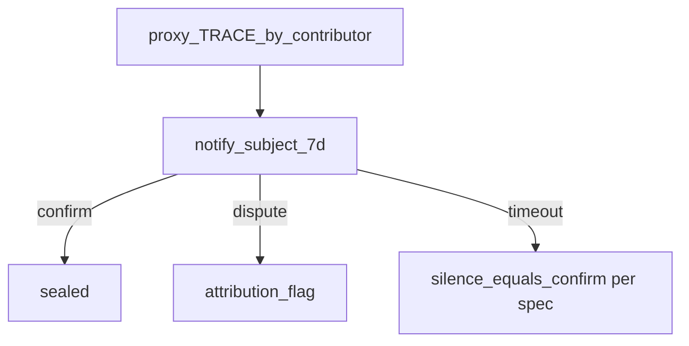
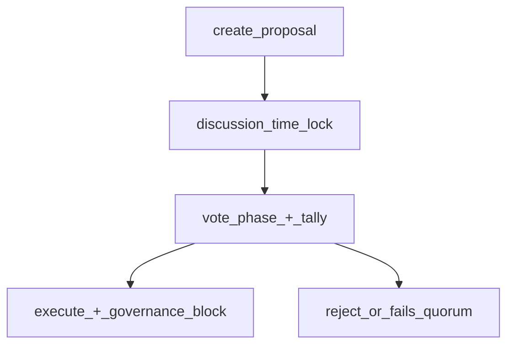

# Chapter 12 — System flows (mapped)

This chapter maps **end-to-end** **flows** in Etch. **Mermaid** diagrams render in many Markdown and DocBook-pipeline tools; if yours does not, **see** the **ASCII** and **narrative** **below** each.

---

## 1. Identity, login, and recovery

| Step | What happens (short) |
|------|------------------------|
| **Register** | `POST /auth/register` → `ChainNode` created; seed shown **once**; `identity` **block** (`addBlock` in `src/routes/auth.ts`). |
| **Login** | `POST /auth/login` → check bcrypt → return **JWT** for `Authorization: Bearer`. |
| **Seed recovery** | User proves 12 words → can reset **password** (and bump `tokenVersion` if implemented for logout-all). |
| **Social recovery (spec + partial impl)** | Trustees **vote**; **time lock**; original node can **veto** a hostile reset. |

**Irrecoverable (spec):** if seed, file backup, and social recovery are all gone — **the account is lost forever**. The platform will not do real-world ID to unlock (by design).  

**Deep dive:** [Chapter 4](04-identity-auth-and-database.md)  

---

## 2. **Space** lifecycle

- **Create:** **creatorAlias**, **settings** (see [Chapter 5](05-spaces.md)). **Financial linking** is **forbidden** and **permanent** `NO` in the **spec** (enforced in product design).  
- **Join** paths depend on `projectAccess` / `inviteCodes`.  
- **Dormant:** no new work; may **fork** a **lineaged** new space.  

---

## 3. **Project** and **trace** (happy path)

- **Start:** only if **space** and **Project** rules allow; creates **`start` block**.  
- **Traces** loop while `Project.status === 'active'`; **redacted** to viewers if `scopeLimited` / `contentFlagged`.  
- **Reference** and **Veto** can interleave.  
- **CREDIT** **ends**; **splits** may **enter mediation** on disagreement.  

---

## 4. **Mediation (credit / veto / ban / classification)**

*Spec steps from* `docs/BACKEND.md` (also summarised in the plan and [Chapter 7](07-contracts.md)). The **`Mediation`** document tracks **status** (`peer_to_peer` → … → `resolved` or `failed`) and can link to a `Flag` via `mediationId`.

---

## 5. **Proxy** log

*See* `src/services/proxyConfirm.ts` *for* **deadline** and **state** in code*.*

---

## 6. **Flag → panel → appeal**

```mermaid
flowchart TD
  U[any_node] --> FL[open_flag w blockIndex]
  FL --> CL[auto_classify_1-4]
  CL --> PNL[assign_panel_+_time_lock]
  PNL --> R1[ruling_1]
  R1 --> AP[appeal_7d]
  AP --> R2[panel_2_+_higher_tier]
  R2 --> AP2[final_7d_+_new_evidence] --> PP[protocol_panel]
  PP --> BIND[binding] 
  R2 --> DPC[or_DISPUTED_CLOSED]
```

*Detail tables:* [Chapter 11](11-moderation-and-flags.md)  

---

## 7. **Protocol governance** (Tier 3, votes)

*Implementation:* `src/routes/governance.ts`, `src/services/governance.ts`, **`addBlock` ** `'governance'`* events* (`proposal_created`, …). See [Chapter 10](10-governance.md).  

---

## 8. **ARCHIVE** and **FORK** (side paths)

- **ARCHIVE** — parallel “retro” track: evidence → (optional) **self/peer/institution** **attestations** → **archive badge** (see [Chapter 7](07-contracts.md)).  
- **FORK** — `parentProjectId` set on child; `fork` **block**; **notify** **parents**; **reputation** **earned only** in **child** (spec).  

---

## 9. **Planned (not a separate runtime yet)**

- **True** **multi-node** **PoR** **validators** on a public network, **synchronised** with this **Mongo** **dApp**  
- **Full** on-chain **NFT** on an **L1** / **L2** (today the **credits** and **nfts** routes may still be **app-local**; see [Chapter 13](13-implemented-vs-planned.md))  

## Further reading

- [Chapters 5–7](05-spaces.md) for the **day-to-day** work  
- [Chapter 11](11-moderation-and-flags.md) for **safety and disputes**  
- [Chapter 13](13-implemented-vs-planned.md) for what is **in git** right now  
